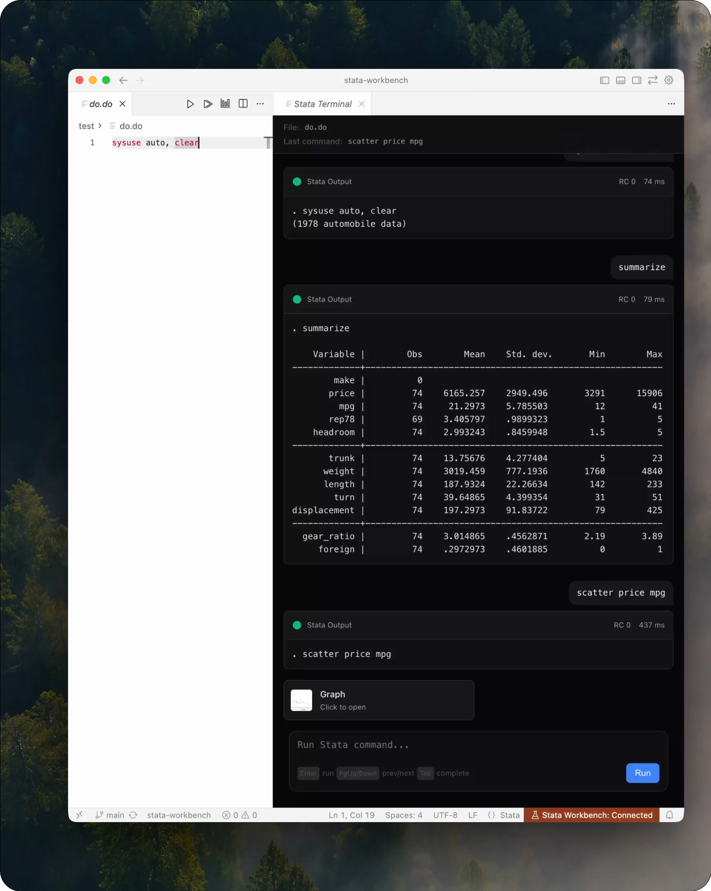
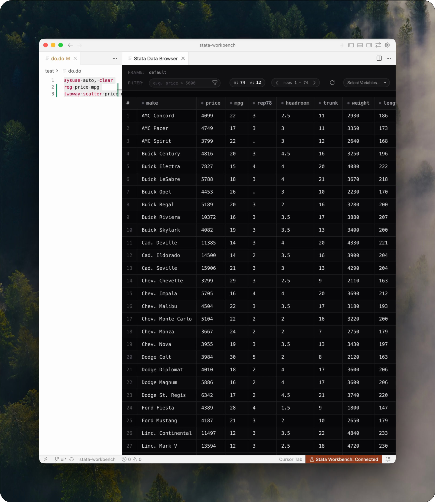

# Stata Workbench
<p align="center">

</p>

A VS Code compatible extension (Cursor, Windsurf, Antigravity etc.) that allows Stata code to be run directly from the editor. Enables AI agents to directly interact with Stata. Powered by [mcp-stata](https://github.com/tmonk/mcp-stata).

Built by [Thomas Monk](https://tdmonk.com), London School of Economics.

## Why use this?

**Run Stata without leaving your editor.** Execute code, see output, and view graphs - all within VS Code. No switching windows, no copying and pasting between your do-file editor and an AI chat.

**For solo work**: A modern IDE for Stata—autocomplete, syntax highlighting, multiple cursors, and an AI assistant that can run commands, inspect your variables, and debug errors directly.

**For collaboration**: Co-authors work in the same environment they use for other code. Shared editor settings, consistent formatting, and AI assistants that understand your project structure.

**For teaching**: Students learn Stata with the same tools they'll use for everything else - inline errors, an integrated terminal, and an AI that can explain what went wrong.

## Installation

Install directly from the marketplace listings by searching for **Stata Workbench** in the Extensions view.

[](https://marketplace.visualstudio.com/items?itemName=tmonk.stata-workbench)
[](https://open-vsx.org/extension/tmonk/stata-workbench)
[](https://open-vsx.org/extension/tmonk/stata-workbench)
[](https://open-vsx.org/extension/tmonk/stata-workbench)

- VS Code Marketplace: [tmonk.stata-workbench](https://marketplace.visualstudio.com/items?itemName=tmonk.stata-workbench)
- Open VSX: [tmonk/stata-workbench](https://open-vsx.org/extension/tmonk/stata-workbench)

Offline/VSIX fallback:
1. Download the latest extension .vsix from the [releases page](https://github.com/tmonk/stata-workbench/releases/latest).
2. In your VS Code/Cursor/Antigravity/Windsurf IDE, open the command palette (`Ctrl+Shift+P` or `Cmd+Shift+P` on Mac) and select `Extensions: Install from VSIX...`.
3. Select the downloaded .vsix file and install.

## Quickstart

1. Install the **Stata Workbench** extension.
2. Open a `.do` file in VS Code (or a compatible editor).
3. Run **Stata: Run Selection/Line** (press the play button on the top right). The **Stata Terminal** panel opens automatically the first time you run a command. You can interact with this as you would a standard Stata terminal.
4. Run:

   ```stata
   sysuse auto, clear
   summarize
   ```

   Output appears as output cards in the panel.
5. Run:

   ```stata
   scatter price mpg
   ```

   A **Graph** artifact card appears - click it to open the generated graph.

6. Open the **Data Browser** panel to view your data live.

<p align="center">
  
  <br />
  <em>Stata Terminal panel showing output cards and a graph artifact.</em>
</p>

<p align="center">
  
  <br />
  <em>Data Browser allows for a live view of your data, with filtering and sorting.</em>
</p>


## Requirements
- Stata 17+ on Mac OS, Windows, or Linux.
- uv/uvx on PATH (to run the published mcp-stata tool). If missing, the extension automatically bootstraps uv locally into its storage.

## Features & Commands
- **Syntax highlighting** for Stata, Dyndoc Markdown, and Dyndoc LaTeX.
- **Run Selection/Current Line** (`stata-workbench.runSelection`) → Executes the selected code or current line via MCP tool `run_command` with normalized output + graphs. Results appear in the terminal panel.
- **Run Current File** (`stata-workbench.runFile`) → Runs the entire `.do` file via MCP tool `run_do_file`. Results appear in the terminal panel.
- **Terminal panel**: Automatically opens when running code, displaying results with stdout/stderr, execution time, return codes, and graph artifacts. You can continue running additional Stata commands directly in the panel. Supports quick history navigation (PageUp/PageDown), Tab-based variable name completion, and clickable links to the full SMCL log. Matches Stata's behavior by providing a **Log tab** for viewing the full session history with efficient tail-loading for large files. Includes an **integrated search** within each card (click the search icon in the card header) with bidirectional highlights, match counts, and keyboard shortcuts (`Enter`/`Shift+Enter` for navigation, `Esc` to close).
- **Graph viewer** (`stata-workbench.showGraphs`): View all graphs from the current Stata session via `list_graphs` and `export_graph` MCP tools. Click any graph to open it.
- **Data Browser** (`stata-workbench.viewData`): Live view of your data with filtering and sorting. Optimized for high performance (~20x faster with Apache Arrow support) and includes a custom variable selector for large datasets.
- **Test MCP Server** (`stata-workbench.testMcpServer`) for quick smoke checks.
- **Install MCP CLI helper** (`stata-workbench.installMcpCli`): Bootstraps uv locally when it is missing.
- **Status bar + cancel** (`stata-workbench.cancelRequest`): Live request states with one-click cancellation routed through the MCP client.
- **Auto-manage MCP configs**: Writes the user-level `mcp.json` in your editor's user data so AI agents reuse the same `uvx --from mcp-stata@latest --refresh mcp-stata` wiring.
- **Durable logs**: All run results are logged to the `Stata Workbench` output channel for reference.

## Settings
- `stataMcp.requestTimeoutMs` (default `100000`): timeout for MCP requests.
- `stataMcp.autoRevealOutput` (default `false`): automatically show the output channel after runs.
- `stataMcp.autoConfigureMcp` (default `true`): automatically add/update the mcp-stata server entry in your host MCP config (`mcp.json`).
- `stataMcp.runFileWorkingDirectory` (default empty): working directory when running .do files. Supports an absolute path, ~, ${workspaceFolder} or ${fileDir}; empty uses the .do file's folder.
- `stataMcp.setupTimeoutSeconds` (default `60`): timeout (seconds) for Stata initialization.
- `stataMcp.maxOutputLines` (default `0`): limit Stata output to N lines (0 = unlimited). Useful for reducing token usage with AI agents.
- `stataMcp.runFileBehavior` (default `runDirtyFile`): choose whether 'Run File' should run the current editor content (including unsaved changes) or the version saved on disk.
- `stataMcp.useBase64Graphs` (default `false`): if true, export graphs as base64 strings; otherwise use file paths. NOT RECOMMENDED: Base64 consumes many more tokens but may be more robust in some remote environments.
- `stataMcp.defaultVariableLimit` (default `100`): default number of variables to select when opening the Data Browser (0 = all). Useful for huge datasets.


## AI Assistant Integration

### Automatic Configuration

Stata Workbench **automatically writes** your MCP configuration when you first run it. The extension detects your editor and creates the appropriate config file.
- User-level `mcp.json` with Stata MCP server entry
- Uses `uvx --from mcp-stata@latest --refresh` for auto-updates
- Works for: Claude Code, Cursor, Cline, Windsurf, Antigravity

**Config file locations:**

| Editor | macOS | Windows | Linux |
|--------|-------|---------|-------|
| **VS Code** | `~/Library/Application Support/Code/User/mcp.json` | `%APPDATA%/Code/User/mcp.json` | `~/.config/Code/User/mcp.json` |
| **VS Code Insiders** | `~/Library/Application Support/Code - Insiders/User/mcp.json` | `%APPDATA%/Code - Insiders/User/mcp.json` | `~/.config/Code - Insiders/User/mcp.json` |
| **Cursor** | `~/.cursor/mcp.json` | `%USERPROFILE%/.cursor/mcp.json` | `~/.cursor/mcp.json` |
| **Windsurf** | `~/.codeium/windsurf/mcp_config.json` | `%USERPROFILE%/.codeium/windsurf/mcp_config.json` | `~/.codeium/windsurf/mcp_config.json` |
| **Windsurf Next** | `~/.codeium/windsurf-next/mcp_config.json` | `%USERPROFILE%/.codeium/windsurf-next/mcp_config.json` | `~/.codeium/windsurf-next/mcp_config.json` |
| **Antigravity** | `~/Library/Application Support/Antigravity/User/mcp.json` | `%APPDATA%/Antigravity/User/mcp.json` | `~/.antigravity/mcp.json` |

If you want to manage the file yourself, here is the content to add. User-level `mcp.json`:
```json
{
  "servers": {
    "mcp_stata": {
      "type": "stdio",
      "command": "uvx",
      "args": ["--from", "mcp-stata", "mcp-stata", "--refresh"]
    }
  }
}
```

## Troubleshooting
- **Icons not visible in editor title bar**: If the play, run, and graph icons don't appear when you open a `.do` file, click the `...` menu in the editor title bar and enable the Stata Workbench icons to make them visible.
- Status bar says "CLI missing": install uv (includes uvx) with `curl -LsSf https://astral.sh/uv/install.sh | sh` (macOS/Linux) or `powershell -NoLogo -NoProfile -ExecutionPolicy Bypass -Command "iwr https://astral.sh/uv/install.ps1 -useb | iex"` (Windows).
- Requests time out: raise `stataMcp.requestTimeoutMs`.
- Unexpected MCP errors: open the output channel for a structured error message.
- Cancel a stuck run: run `Stata: Cancel Current Request` from the command palette.

## Uninstall cleanup (optional)
If you added agent configs and want to remove them, edit your user-level `mcp.json` (same path as above) and delete the relevant entry:
- VS Code format → delete `servers.mcp_stata`
- Cursor format → delete `mcpServers.mcp_stata`

## Acknowledgments
Portions of this file are derived from [stata-mcp](https://github.com/hanlulong/stata-mcp) (MIT License), [language-stata](https://github.com/kylebarron/language-stata) by Kyle Barron (MIT License), and [vscode-stata](https://github.com/kylebutts/vscode-stata) by Kyle Butts (MIT License). See license_extras for the full license texts. Do check their projects out!
