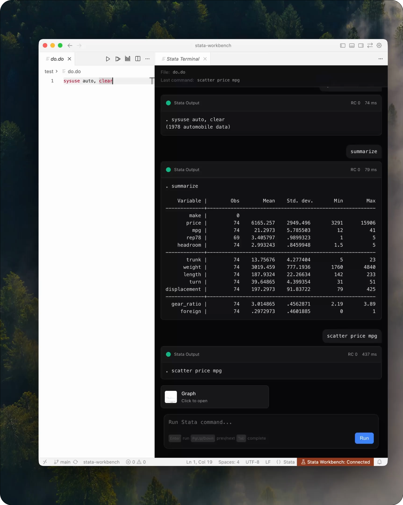
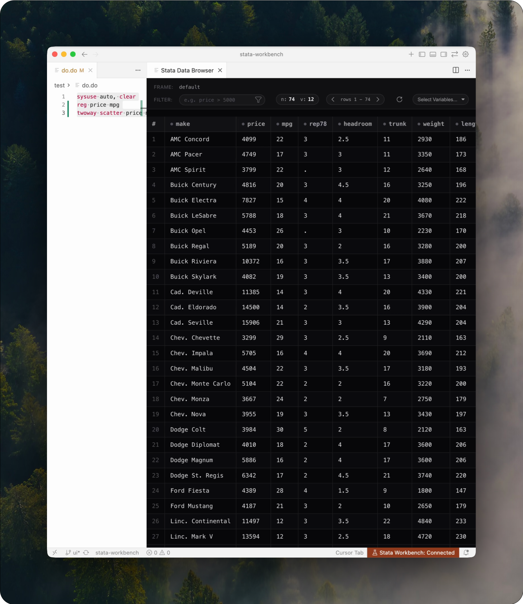

# Stata Workbench
<p align="center">

</p>

**Stata Workbench** is unified agentic toolkit for Stata development. The toolkit gives AI agents native control over Stata - run commands, inspect variables, export graphs, and build more quickly and reliably than native Stata alone. Built as a VS Code extension (Cursor, Windsurf, Antigravity), so your agent works inside your editor. Powered by [mcp-stata](https://github.com/tmonk/mcp-stata). Featured in <a href="https://www.stata.com/stata-news/news41-2/community-corner-ai-tools/"> News</a>.

Built by [Thomas Monk](https://tdmonk.com), London School of Economics.


[](https://open-vsx.org/extension/tmonk/stata-workbench)

## Why use this?

**Run Stata without leaving your editor.** Execute code, see output, and view graphs - all within VS Code. No switching windows, no copying and pasting between your do-file editor and an AI chat.

**For solo work**: A modern IDE for Stata—autocomplete, syntax highlighting, multiple cursors, and an AI assistant that can run commands, inspect your variables, and debug errors directly.

**For collaboration**: Co-authors work in the same environment they use for other code. Shared editor settings, consistent formatting, and AI assistants that understand your project structure.

**For teaching**: Students learn Stata with the same tools they'll use for everything else - inline errors, an integrated terminal, and an AI that can explain what went wrong.

## Installation

Install directly from the marketplace listings by searching for **Stata Workbench** in the Extensions view.

[](https://marketplace.visualstudio.com/items?itemName=tmonk.stata-workbench)
[](https://open-vsx.org/extension/tmonk/stata-workbench)
[](https://open-vsx.org/extension/tmonk/stata-workbench)
[](https://open-vsx.org/extension/tmonk/stata-workbench)

- VS Code Marketplace: [tmonk.stata-workbench](https://marketplace.visualstudio.com/items?itemName=tmonk.stata-workbench)
- Open VSX: [tmonk/stata-workbench](https://open-vsx.org/extension/tmonk/stata-workbench)

Offline fallback:
1. Download the latest extension .vsix from the [releases page](https://github.com/tmonk/stata-workbench/releases/latest).
2. In your VS Code/Cursor/Antigravity/Windsurf IDE, open the command palette (`Ctrl+Shift+P` or `Cmd+Shift+P` on Mac) and select `Extensions: Install from VSIX...`.
3. Select the downloaded .vsix file and install.

## Quickstart

1. Install the **Stata Workbench** extension.
2. Open a `.do` file in VS Code (or a compatible editor).
3. Run **Stata: Run Selection/Line** (press the play button on the top right). The **Stata Terminal** panel opens automatically the first time you run a command. You can interact with this as you would a standard Stata terminal.
4. Run:

   ```stata
   sysuse auto, clear
   summarize
   ```

   Output appears as output cards in the panel.
5. Run:

   ```stata
   scatter price mpg
   ```

   A **Graph** artifact card appears - click it to open the generated graph.

6. Open the **Data Browser** panel to view your data live.

<p align="center">
  
  <br />
  <em>Stata Terminal panel showing output cards and a graph artifact.</em>
</p>

<p align="center">
  
  <br />
  <em>Data Browser allows for a live view of your data, with filtering and sorting.</em>
</p>


## Requirements
- Stata 17+ on macOS, Windows, or Linux.
- **mcp-stata**: The extension requires the `mcp-stata` toolkit. If it is not found, you will be prompted to run the installation script.

## Features

Stata Workbench is a unified **agentic toolkit** for Stata development, providing a rich IDE experience with deep AI integration:

- **Integrated Terminal**: Rich UI for tracking Stata output with clickable links, integrated search, and persistent history. Provides a **Log tab** for viewing the full session history with efficient tail-loading.
- **Data Browser** (`stata-workbench.viewData`): High-performance view of millions of rows (~20x faster with Apache Arrow) with live filtering and sorting.
- **Advanced MCP Tools**: Full suite of tools for AI agents (Run, Inspect, Export Graphs, State Diff).
- **Run Selection/Current Line** (`stata-workbench.runSelection`): Executes the selected code or current line via MCP tool `run_command` with normalized output and graphs.
- **Run Current File** (`stata-workbench.runFile`): Runs the entire `.do` file via MCP tool `run_do_file`.
- **Environment Detection** (`stata_manage_session` action="detect"): Returns Stata version, flavor, and OS metadata.
- **Code Linting** (`stata_inspect_data` action="lint"): Static analysis of `.do` and `.ado` files to identify style violations and potential errors.
- **Modern Stata Skill**: A specialized knowledge base for agents to use frames, `gtools`, and other modern Stata features instead of legacy anti-patterns.
- **Setup Toolkit** (`scripts/setup_toolkit.py`): Automated registration for Claude Desktop, Codex, VS Code, and Cursor in one command.
- **Auto-manage MCP configs**: Synchronizes your host MCP settings (`mcp.json`) across your favorite AI editors.
- **Status Bar + Cancel** (`stata-workbench.cancelRequest`): Live request states with one-click cancellation.
- **Test MCP Server** (`stata-workbench.testMcpServer`): Quick smoke checks to verify your Stata connection.
- **Syntax Highlighting**: Full support for `.do`, `.ado`, `.mata`, Dyndoc Markdown, and Dyndoc LaTeX.
- **Install MCP CLI helper** (`stata-workbench.installMcpCli`): Bootstraps the `mcp-stata` toolkit locally when it is missing from the environment.
- **Durable logs**: All run results are logged to the `Stata Workbench` output channel for persistent reference.

For a detailed breakdown of all capabilities, see [FEATURES.md](FEATURES.md).

## Settings
- `stataMcp.requestTimeoutMs` (default `100000`): timeout for MCP requests.
- `stataMcp.autoRevealOutput` (default `false`): automatically show the output channel after runs.
- `stataMcp.autoConfigureMcp` (default `true`): automatically add/update the mcp-stata server entry in your host MCP config (`mcp.json`).
- `stataMcp.configureClaudeCode` (default `false`): register mcp-stata via `claude mcp add-json` at user scope. Ensures both Claude Code CLI and VS Code extension see the server. Requires `claude` on PATH.
- `stataMcp.configureCodex` (default `false`): also configure Codex CLI and VS Code extension MCP settings.
- `stataMcp.codexConfigPath` (default `~/.codex/config.toml`): path to Codex MCP config. Supports `~` and `${workspaceFolder}`.
- `stataMcp.runFileWorkingDirectory` (default empty): working directory when running .do files. Supports an absolute path, ~, ${workspaceFolder} or ${fileDir}; empty uses the .do file's folder.
- `stataMcp.setupTimeoutSeconds` (default `60`): timeout (seconds) for Stata initialization.
- `stataMcp.noReloadOnClear` (default `false`): disable reloading startup/profile do files after clear all/program drop.
- `stataMcp.maxOutputLines` (default `0`): limit Stata output to N lines (0 = unlimited). Useful for reducing token usage with AI agents.
- `stataMcp.runFileBehavior` (default `runDirtyFile`): choose whether 'Run File' should run the current editor content (including unsaved changes) or the version saved on disk.
- `stataMcp.defaultVariableLimit` (default `100`): default number of variables to select when opening the Data Browser (0 = all). Useful for huge datasets.


## AI Assistant Integration

### Automatic Configuration

MCP configuration is **synced on extension load and when you toggle the relevant settings**. When a setting is enabled, the extension adds or updates the mcp-stata entry in that config. When you turn the setting off, the extension **removes** the mcp_stata entry cleanly.

| When | Behaviour |
|------|-----------|
| Extension loads | Adds/updates mcp-stata in each enabled config target |
| Setting toggled ON | Adds/updates mcp-stata in that config |
| Setting toggled OFF | Removes mcp_stata from that config |

The extension detects your editor and writes to the appropriate config file(s).
- User-level `mcp.json` with Stata MCP server entry
- The extension delegates initial server configuration to the `mcp-stata` installer.
- Works for: VS Code, Cursor, Windsurf, Antigravity
- Optional: Claude Code CLI and extension when `stataMcp.configureClaudeCode` is enabled
- Optional: Codex CLI and extension when `stataMcp.configureCodex` is enabled

**Config file locations:**

| Editor | macOS | Windows | Linux |
|--------|-------|---------|-------|
| **VS Code** | `~/Library/Application Support/Code/User/mcp.json` | `%APPDATA%/Code/User/mcp.json` | `~/.config/Code/User/mcp.json` |
| **VS Code Insiders** | `~/Library/Application Support/Code - Insiders/User/mcp.json` | `%APPDATA%/Code - Insiders/User/mcp.json` | `~/.config/Code - Insiders/User/mcp.json` |
| **Cursor** | `~/.cursor/mcp.json` | `%USERPROFILE%/.cursor/mcp.json` | `~/.cursor/mcp.json` |
| **Windsurf** | `~/.codeium/windsurf/mcp_config.json` | `%USERPROFILE%/.codeium/windsurf/mcp_config.json` | `~/.codeium/windsurf/mcp_config.json` |
| **Windsurf Next** | `~/.codeium/windsurf-next/mcp_config.json` | `%USERPROFILE%/.codeium/windsurf-next/mcp_config.json` | `~/.codeium/windsurf-next/mcp_config.json` |
| **Antigravity** | `~/Library/Application Support/Antigravity/User/mcp.json` | `%APPDATA%/Antigravity/User/mcp.json` | `~/.antigravity/mcp.json` |
| **Claude Code CLI & extension** | Via `claude mcp add-json` (user scope) | same | same |
| **Codex CLI & extension** | `stataMcp.codexConfigPath` (default `~/.codex/config.toml`) | same | same |

If you want to manage the file yourself, here is the content to add. User-level `mcp.json`:
```json
{
  "servers": {
    "mcp_stata": {
      "type": "stdio",
      "command": "uvx",
      "args": ["--refresh", "--refresh-package", "mcp-stata", "--from", "mcp-stata@latest", "mcp-stata"]
    }
  }
}
```

## Troubleshooting
- **Claude Code extension doesn't see MCPs**: We use `claude mcp add-json` so both CLI and extension share the same config. Ensure `claude` is on PATH and `stataMcp.configureClaudeCode` is enabled. Restart the Claude Code panel after changes.
- **Icons not visible in editor title bar**: If the play, run, and graph icons don't appear when you open a `.do` file, click the `...` menu in the editor title bar and enable the Stata Workbench icons to make them visible.
- **Status bar says "CLI missing"**: Install `mcp-stata` manually with `curl -LsSf https://mcp-stata-install.tdmonk.com/install.sh | bash` (macOS/Linux) or `irm irm https://mcp-stata-install.tdmonk.com/install.ps1 | iex | iex` (Windows).
- **Requests time out**: raise `stataMcp.requestTimeoutMs`.
- Unexpected MCP errors: open the output channel for a structured error message.
- Cancel a stuck run: run `Stata: Cancel Current Request` from the command palette.

## Uninstall cleanup (optional)
**Automatic removal:** Turn off `stataMcp.autoConfigureMcp`, `stataMcp.configureClaudeCode`, or `stataMcp.configureCodex` in settings; the extension removes the mcp_stata entry immediately.

**Manual removal:** Edit the config file and delete the relevant entry:
- VS Code format → delete `servers.mcp_stata`
- Cursor format → delete `mcpServers.mcp_stata`
- Claude Code → run `claude mcp remove mcp_stata`, or turn off `stataMcp.configureClaudeCode` to auto-remove
- Codex → delete `[mcp_servers.mcp_stata]` and `[mcp_servers.mcp_stata.env]` from `~/.codex/config.toml`

## Telemetry

This extension uses Sentry to collect error and performance data to improve reliability. No personal data is collected. You can disable telemetry by setting `"stata-workbench.telemetry.enabled": false` in your VS Code settings.

## Acknowledgments
Portions of this file are derived from [stata-mcp](https://github.com/hanlulong/stata-mcp) (MIT License), [language-stata](https://github.com/kylebarron/language-stata) by Kyle Barron (MIT License), and [vscode-stata](https://github.com/kylebutts/vscode-stata) by Kyle Butts (MIT License). See license_extras for the full license texts. Do check their projects out!
